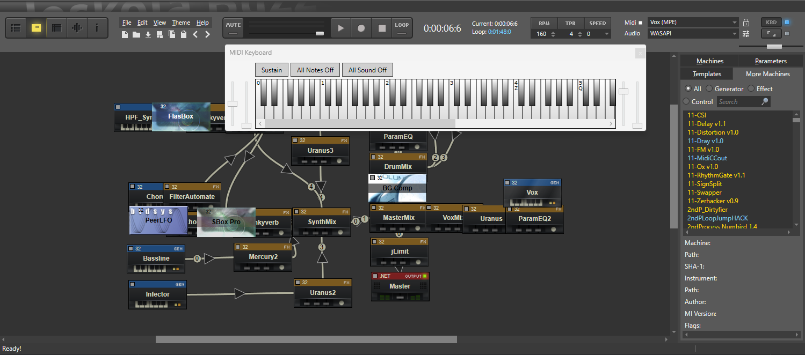
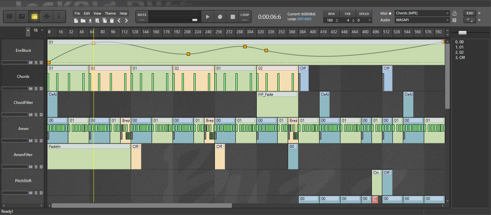

# ReBuzz
ReBuzz is a modular digital audio workstation (DAW) built upon the foundation of [Jeskola Buzz](https://jeskola.net/buzz/) software. Written in C#, ReBuzz combines modern features with the beloved workflow of its predecessor. While it’s still in development, users should exercise some caution regarding stability and other potential uncertainties. The primary focus is on providing a stable experience and robust VST support.

| Machine View | Editor View | Sequencer View |
| ------------ | ------------ | ------------ |
|  |  |  |

## Features
* 32 and 64 bit VST2/3 support
* 32 and 64 bit buzz machine support
* Modern Pattern Editor, Modern Sequence Editor, AudioBlock, EnvelopeBlock, CMC, TrackScript...
* Multi-process architecture
* Multi-io for native and managed machines
* Includes [NWaves](https://github.com/ar1st0crat/NWaves) .NET DSP library for audio processing
* bmx and bmxml file support
* ...

## Download
[ReBuzz Installer](https://github.com/wasteddesign/ReBuzz/releases/latest)

Requires:
1. [.NET 9.0 Desktop Runtime - Windows x64](https://dotnet.microsoft.com/en-us/download/dotnet/thank-you/sdk-9.0.100-windows-x64-installer)
2. [Latest Microsoft Visual C++ Redistributable](https://learn.microsoft.com/en-us/cpp/windows/latest-supported-vc-redist?view=msvc-170)

## How to build?
1. Clone this repo. **IMPORTANT: Clone with --recurse-submodules** <br>

2. Load the ReBuzz.sln (located at \ReBuzz\ReBuzz.sln) **In Visual Studio 2022** (Community version will suffice) 

3. Ensure ReBuzz is the Startup project. It should be highlighted bold in the Solution Explorer.<br><br>
    If it is not, then right click the ReBuzz project in Solution Explorer, and select "Set as Startup Project"

4. Build all.

5. The result should be output to (depending on if Debug or Release is selected):<br>
    - <repo dir>\bin\Debug\x64\net9.0-windows\ <br>
    - <repo dir>\bin\Release\x64\net9.0-windows\ <br>

6. You should be able to run ReBuzz directly from there.

In order to prevent pollution of the source tree(s), **all** intermediate files are located in: <br>
    - <repo dir>\build

    This has been achieved by (*This is information only. This is only useful when adding new projects to ReBuzz*): <br>
      - Placing ``Directory.build.props`` in each project (same level as each .csproj file) <br>
      - *Manually* setting the following in the .csproj: <br>
        ```xml
        <IntermediateOutputPath>$(SolutionDir)build\$(Configuration)\$(Platform)\Rebuzz\obj</IntermediateOutputPath>
        ```
      - Output directory set to ``root\ReBuzz\bin``, also set in the csproj files using the following: <br>
        ```xml
        <OutputPath>$(SolutionDir)bin\$(Configuration)</OutputPath>
        ```
     - *Adding instructions into the csproj files to manaully* generate ``project.assets.json``, because for some reason, MSBuild is incapable of detecting that this file is missing and does not peform a restore by itself:<br>
     ```xml
     <Target Name="ForcePerformRestore" AfterTargets="BeforeBuild">
         <Exec Command="IF NOT EXIST  &quot;$(IntermediateOutputPath)..\project.assets.json&quot;  echo restore to $(IntermediateOutputPath)..\project.assets.json &amp;&amp;  dotnet restore &quot;$(ProjectName).csproj&quot;  --no-dependencies &amp;&amp; move &quot;build\$(ProjectName)\obj\*&quot; &quot;$(IntermediateOutputPath)..&quot; &amp;&amp; rmdir /Q /S build	 " />
    </Target>

   <Target Name="RemoveEmptyObj" AfterTargets="AfterBuild">
         <Exec Command="IF EXIST obj rmdir obj" />
   </Target>

## Notes

* To speed up debugging in Visual Studio, set Data Binding Off under Tools -> Options -> Debugging -> Output Window -> WPF Trace Settings
* Set an exception for ReBuzz.exe process in Windows Defender if starting up ReBuzz takes too long.

ReBuzz uses multi-process architecture. To debug a native machine that is loaded by ReBuzzEngine in Visual Studio you can for example:
1. Add a break point in MachineManager.CreateNativeMachine
https://github.com/wasteddesign/ReBuzz/blob/1243cc9ef40e4c25804c462d290d511c02b37054/ReBuzz/MachineManagement/MachineManager.cs#L236
3. Add a break point to ReBuzzEngine.cpp IPC::UILoadLibrary
https://github.com/wasteddesign/ReBuzz/blob/1243cc9ef40e4c25804c462d290d511c02b37054/ReBuzzEngine/rebe/ReBuzzEngine.cpp#L144
4. Start ReBuzz debug session
5. When break point is hit, do _Attach to Process..._ and find _ReBuzzEngine_
6. Continue debugging

## How can I help?
All the basic functionality is implemented but there many areas to improve. In general, contributions are needed in every part of the software, but here are few items to look into:

- [ ] Pick an [issue](https://github.com/wasteddesign/ReBuzz/issues) and start contributing to Rebuzz development today!
- [ ] Improve stability, fix bugs and issues
- [ ] Cleanup code and architecture
- [ ] Add comments and documentation
- [x] Improve Audio wave handling (Wavetable)
- [ ] Improve file handling to support older songs
- [ ] Reduce latency, optimize code


Let's make this a good one.
